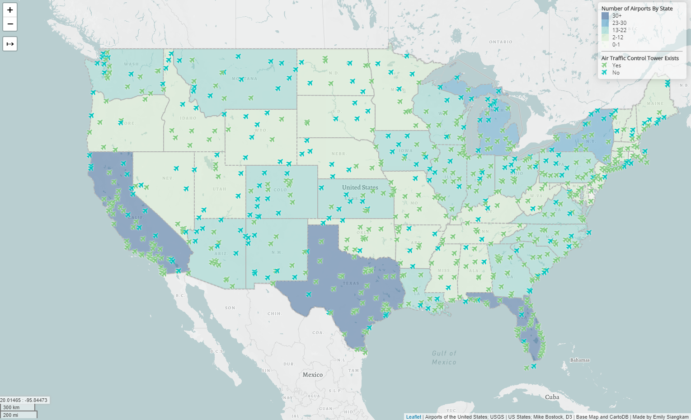

# Airports and Air Traffic Control Towers in the United States

View the map at https://esiangkam.github.io/airportsandtowers/index.html 

## Introduction
This project provides a visualization of airports located throughout the United States, as well as where air traffic control towers are and are not located. It becomes apparent that most areas that have both a higher number of airports and air traffic control towers are correlated with a higher population of people.

## Primary Functions
This map displays two different types of information, the first being number of airports in each state, and the second being airports with and without air traffic control towers. The number of airports are distinguished using polygons in order to create a choropleth map, with darker colors being demonstrative of a greater number. Additionally, airplanes are symbolized throughout the map in blue and green. Green indicates there is indeed an air traffic control tower, while blue indicates the airport does not have one.

There are additional features on the map to aid the user's experience. These include a scale bar that allows the user to see both kilometers and miles as they zoom in on the map. Furthermore, each airplane on the map has a popup on click, which tells the user the name of the airport, along with the city and state.

To further enhance user experience, a person can use the PolylineMeasure tool in order to measure distances of simple lines and complex polylines, as well as read coordinates on the bottom left corner of the screen as their mouse hovers anywhere on the map.

## Libraries
- Leaflet
  - Interactive JavaScript map library
  - [Leaflet.PolylineMeasure plugin](https://github.com/ppete2/Leaflet.PolylineMeasure)
  - [L.Control.MousePosition plugin](https://github.com/ardhi/Leaflet.MousePosition)
- Font Awesome
  - Web icon sets and toolkits; source of airplane icons
- JQuery
  - JavaScript library for HTML document traversal and manipulation, event handling, animation, etc.
- Chroma.js
  - Javascript library for color conversions and color scales

## Data Sources
- airports.geojson: converted from a [shapefile via USGS](https://catalog.data.gov/dataset/usgs-small-scale-dataset-airports-of-the-united-states-201207-shapefile) on the data.gov website
- us-states.geojson: data acquired from [Mike Bostock](http://bost.ocks.org/mike) of [D3](http://d3js.org/)
- Leaflet.PolylineMeasure plugin: [ppete2 on Github](https://github.com/ppete2/Leaflet.PolylineMeasure)
- Leaflet.MousePosition plugin: [ardhi on Github](https://github.com/ardhi/Leaflet.MousePosition)

## Acknowledgment
This map was developed with the guidance of Professor Bo Zhao for lab assignment in GEOG 458. Much of the code has been sampled from and edited in order to recreate a map specific to airports and air traffic control towers.
